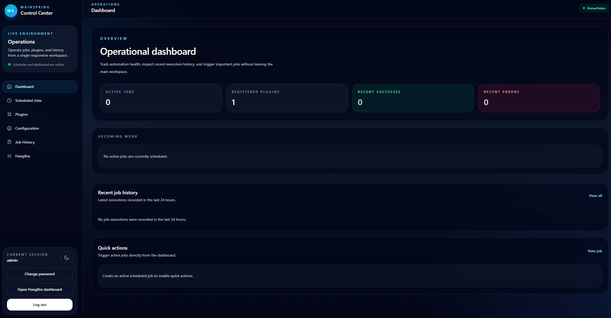

# MainSpringTwo.Web

MainSpringTwo is a port of an old .NET Framweork 4.6.1 web application I wrote 10+ years ago. It combines ASP.NET Core Identity, Hangfire, SQLite, Tailwind CSS 4, and Alpine.js to provide a polished operational dashboard for scheduled plugin execution. It deviates from the original by not implementing a multi-host model, instead focusing on a single-instance application with a read-only plugin catalog and inline configuration editing. [KronoMata](https://github.com/mufaka/Kronomata) is a better replacement for the original multi-host use case.



## Features

- Responsive control center layout with light and dark mode
- ASP.NET Core Identity login, registration, logout, and access denied pages
- Hangfire server and authenticated dashboard integration
- Scheduled job CRUD with inline plugin configuration editing
- Read-only compiled plugin catalog
- Application configuration management
- Paginated job history filtered to the last 7 days
- Tailwind CSS build pipeline integrated into `dotnet build`

## Project structure

- `Controllers/` - MVC controllers for dashboard, jobs, plugins, configuration, and history
- `Areas/Identity/` - customized Razor Pages for authentication
- `Data/` - EF Core DbContext, migrations, and seed logic
- `Jobs/` - Hangfire jobs and dashboard authorization filter
- `Models/` - entities, plugin contracts, and view models
- `Plugins/` - compiled plugin implementations such as `SamplePlugin`
- `Services/` - scheduling and plugin registry services
- `Views/` - Tailwind-based MVC views and shared partials

## Local development

### Prerequisites

- .NET 10 SDK
- Node.js and npm

### First run

From `MainSpringTwo.Web/`:

```powershell
dotnet build
```

This restores NuGet packages, installs npm dependencies, and builds `wwwroot/css/app.min.css`.

Then run the app:

```powershell
dotnet run
```

## Default credentials

The seed process creates a default administrator on first run:

- Username: `admin`
- Email: `admin@localhost`
- Password: `ChangeMe123!`

## Database

The app uses SQLite with the connection string from `appsettings.json`:

- `Data Source=mainspring.db`

EF Core migrations are applied automatically at startup.

## Testing

Run the scheduling tests with:

```powershell
dotnet test ..\MainSpringTwo.Tests\MainSpringTwo.Tests.csproj
```

## Notes

- Hangfire currently uses in-memory storage.
- The Hangfire dashboard is exposed at `/hangfire` and requires authentication.
- Plugin metadata is synchronized into the database during application startup.
